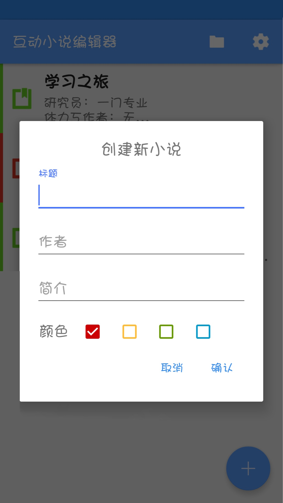
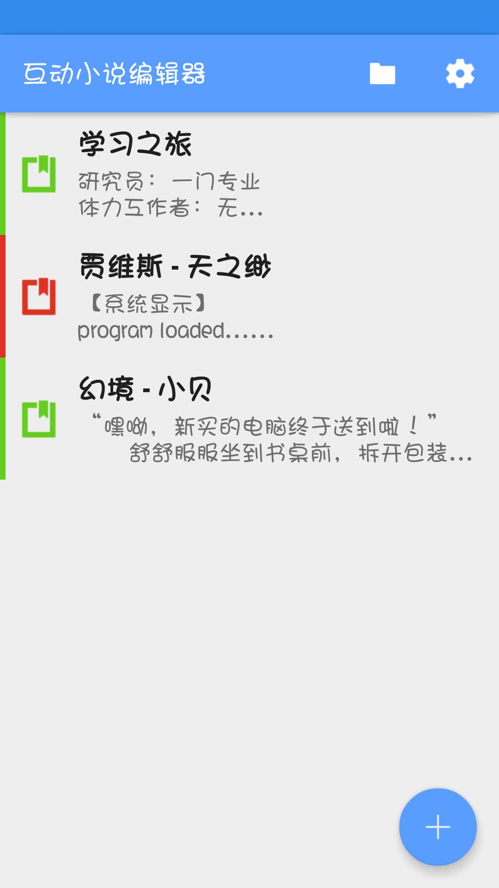
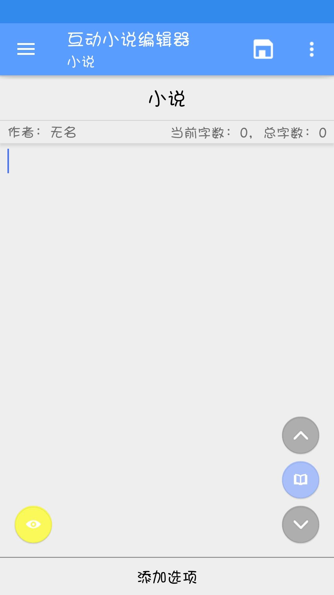
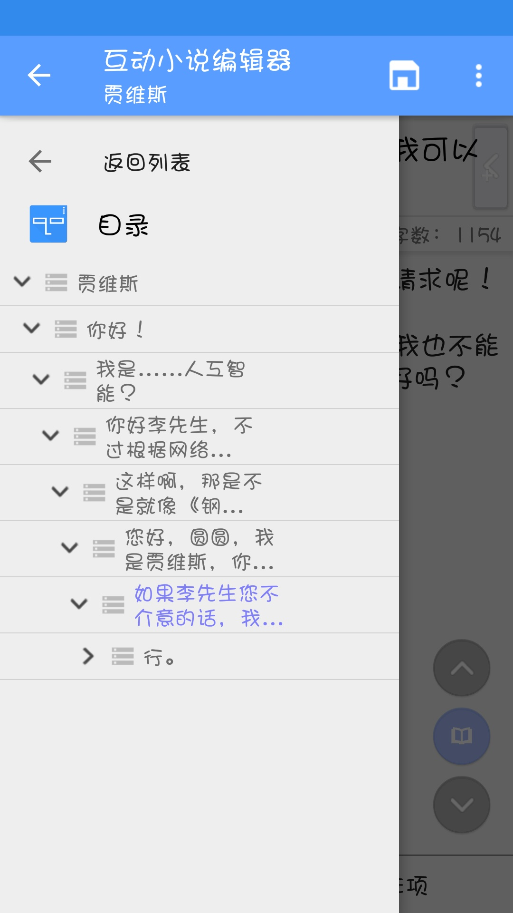
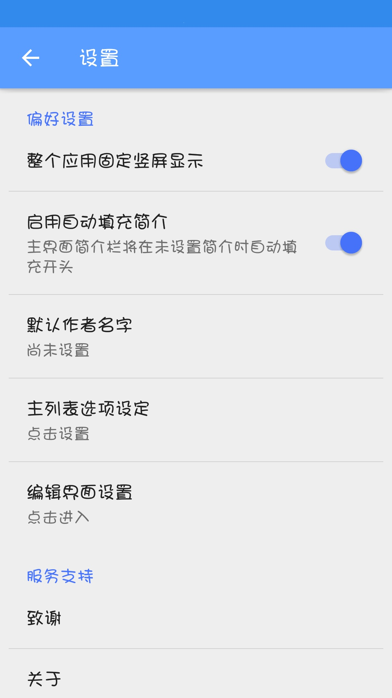
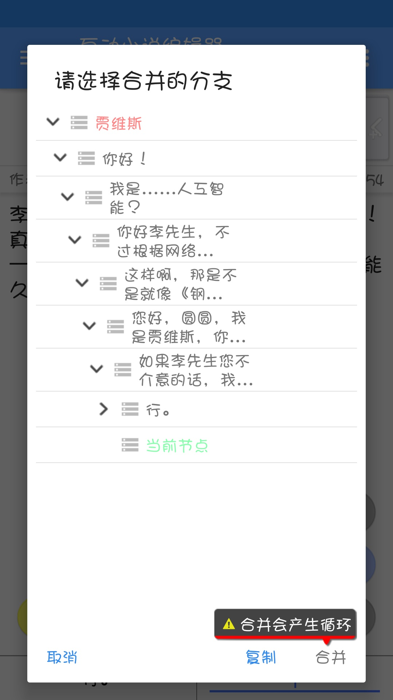

# 互动小说编辑器

#

互动小说编辑器是安卓系统手机上的一款软件，他为拥有不同分支的互动小说或者游戏剧情设计提供了在手机上编辑的舒适体验。

他的功能包括：

1. 建立与编辑小说内容，每个节点可创建一至两个子节点作为分支。
2. 合并节点，将两个位置链接的内容合并为一个节点，此节点在任一处编辑均会发生改变。
3. 丰富的设置让程序更好用。
4. 主页可以根据喜好、重要性或分类设置小说颜色
5. 可以通过导航栏跳转节点或者直接使用标题切换按钮在兄弟节点间跳跃。

以下是部分截图。

