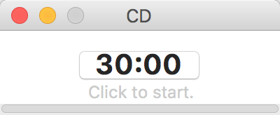

# 倒计时

“倒计时”是一款基于`python`的小程序，它使用干净方便的可视化界面提供了倒计时的功能。

打开程序可以看到倒计时的时间显示，点击它可以进入倒计时状态，倒计时过程中也可以点击来暂停。

双击时间可以编辑，编辑时可以使用`h`, `m`, `s`或`hours`, `minutes`, `seconds`来表示时、分、秒，如下图所示。

倒计时过程中会辅有进度条提示倒计时进度，而结束后会响铃提示。

