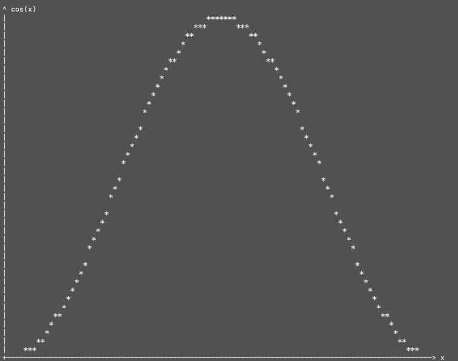
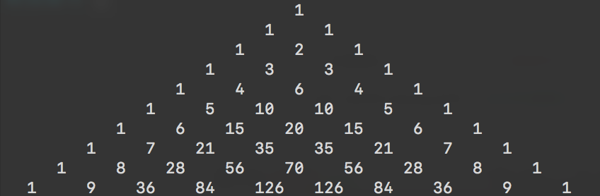

# 附加练习

#### 1. 字数统计

编写函数`wordcount(text)`实现对于输入字符串的词数统计。

要求：输入字符串`text`，以所有非英文字母（除去`'`和`-`）为单词的分隔符制作分割后的单词列表并统计单词个数。

#### 2. 列表拉直

编写函数`flatlist(list_)`将嵌套列表中所有的元素置入一个列表中。

如：将`[1,3,[3,[4,5,[6],[[],{1:2}],3],(0,1),2]]`拉直成为`[1,3,3,4,5,6,{1:2},3,(0,1),2]`。
要求：尝试分别使用列表方法与字符串方法实现这一点。进一步尝试拉直所有迭代对象。

#### 3. 凯撒密码

编写函数`caesar(str_)`实现平移$k$位的凯撒密码加密（即将每个字母按照字母表替换为$k$个位置之后的字母），保持字母大小写不变，非英文字母不改变。
如：`It is coming!`将变为`Lw lv frplqj!`。

#### 4. 函数绘图

编写函数`plot(f[, width, height, xlim, ylim, xlabel, ylabel])`用`*`实现函数$f$图线的绘制，要求绘制出来的图片占有$height\times width$个字符空间，绘制定义域、值域范围`xlim, ylim`可以由用户输入。、

例如：`cos(x)`在`[-1, 1]`间的图像如下图所示。



#### 5. 寻找第k大数

编写函数`kmax(array[, k])`寻找输入序列中第$k$大的数，尝试不使用排序以$O(n)$的算法复杂度完成这项任务。

提示：可以尝试类似于快速排序大小分开的方式二分处理。

#### 6. 有理数类

编写一个有理数类`rational`（对象），实现以下功能：

- 分布保存整型数分子与分母

- 始终保持分数为既约分数

- 使用函数或字符串显示函数重载格式化显示分数

- 实现加、减、乘、除（可以使用运算符重载）

- 构造函数能够做到对格式化字符串和数值的强制类型转换

提示：

以下函数`GCD`使用欧拉算法返回两个输入整数的最大公约数。

```python
def GCD(a, b):
    while b > 0:
        c = b
        b = a % b
        a = c
    return a
```

以下函数`isint`判断输入数据是否足够接近于整数。

```python
isint = lambda x: abs(x - round(x)) < 1e-4
```

借用递归返回距离`x`足够近的分数的分子与分母元组对，参数`maxiter`确定了精度。

```python
@staticmethod
def nearest(num, maxiter=100):
    def iter(x, d):
        if isint(x) or d >= maxiter: return int(round(x)), 1
        niter = iter(1 / (x - int(x)), d+1)
        return int(x) * niter[0] + niter[1], niter[0]
    if num >= 0: return iter(num, 0)
    num = iter(-num, 0)
    return -num[0], num[1]
```

文件`rational_template.py`已经完成了大部分内容，请修改替换七处`raise`函数。

#### 7. 素数列表

编写函数`prime(N)`返回一个序列，包含$N$以内所有素数。尝试将计算复杂度降为$\displaystyle O(\frac{n\sqrt n}{\log n})$，即对于每个数仅验证小于其算术平方根的素数是否是其因子。

#### 8. 素因数分解

编写函数`frac(x)`返回一个序列，包含$x$的素因数分解（$x<10000$）。

要求：返回的序列每个元素都是二元元组，分别表示素数和当前素数的幂次，幂次要求为正整数。
请利用以下代码输出结果。

```python
def symbolize(num, symbols):	# not implemented
    
def printresult(x):
    factors = frac(x)
    sup = lambda x: symbolize(x, "⁰¹²³⁴⁵⁶⁷⁸⁹")
    print(x, '=', '⋅'.join([str(p[0]) + (sup(p[1]) if p[1] > 1 else '') for p in factors]))

if __name__ == "__main__":
    printresult(169400)
```

其中函数`symbolize`函数将`x`的每一位替换为字符串中的对应元素，如将`12`转换为`¹²`，请尝试以尽量简便的方式实现这个函数。

最终输出结果应该是：`169400 = 2³⋅5²⋅7⋅11² `

#### 9. 排列组合

编写函数`C(n, k)`与`P(n, k)`实现组合数与排列数的计算。利用$C_n^k = C_{n-1}^{k-1}+C_{n-1}^k$减小数据大小防止溢出，并尝试通过离线打表加快运行速度（即现做出$n<N$时的所有组合数然后通过查表实现组合数运算）。

可以通过下列语句输出计算好的组合数表格`CTable`。

```python
if __name__ == "__main__":
N = 10
for n in range(N):
print(' ' * (3*(N-n-1)) + ' '.join(['{:^5d}'.format(x) for x in Ctable[n]]))
```



#### 10. 快速幂

编写函数`fpower(x, k)`实现快速幂：

$$
x^k = x^{\sum_{i=0}^\infty a_i\cdot2^i} = \prod_{i=0}^\infty (x^{2^i})^{a_i}
$$

其中$a_i$取值为$0$或$1$，是正整数$k$的二进制展开后的数位。注意$x^{2^i} = \big(x^{2^{i-1}}\big)^2$，因此通过循环求幂复杂度达到$O(k)$，而快速幂的运算量只有$O(\log k)$。

#### 11.迷宫寻路算法

编写函数`findpath(map)`寻找在二维迷宫地图`map`中从入口走到出口的最短路径。
其中`map`由`-2`, `-1`, `0`和`1`构成，`1`表示迷宫的墙壁，无法通行，`-1`表示迷宫入口，`-2`表示出口，`0`表示空地，可以随意走动。输入确保入口和出口有且仅有一个。输出由一个坐标序列构成，表示最短的路径（包含出入口）。提示：使用广度优先搜索算法实现这项任务。
可以使用以下函数输出地图，输出时使用`2`表示路径。

```python
def printpathonmap(path, map, symbol_start='@', symbol_end='#',
                              symbol_path='⋅', symbol_wall='▒'):
    for p in path:
        if map[p[0]][p[1]] == 0: map[p[0]][p[1]] = 2
    symbol = {-1: symbol_start, -2: symbol_end, 0: ' ', 1: symbol_wall, 2:symbol_path}
    print(' '.join([symbol_wall] * (len(map[0]) + 2)))
    print('\n'.join([' '.join([symbol_wall] + [symbol[x] for x in row] +
                              [symbol_wall]) for row in map]))
    print(' '.join([symbol_wall] * (len(map[0]) + 2)))
```

#### 12. 生成迷宫

在上题的基础上，编写函数`newmaze()`随机生成一个有解的迷宫。

#### 13. 随机数据流图像

编写程序`random01.py`实现随机落下的`0,1`序列。
要求：大致做成以下效果，确保各个数位的下落速度有一定区别，并且随机生成的`0`和`1`以较大的概率落在同一列。


提示：一种周期性运行到代码如下：

```python
def ontimer():
    ...# 代码片段

    global timer
    timer = threading.Timer(0.1, ontimer) # 每0.1s执行一次ontimer
    timer.start()

ontimer()
```

可以用以下代码实现清屏。

```python
import os
os.system('clear')
```

周期运行也可以借用`tool.py`中实现的包装器`@periodic`，包装器的使用在`random01_template.py`中已经实现。

#### 14. 表达式分析

实现`evaluate(expr, **vars)`函数计算表达式`expr`的值，对于表达式中的变量使用`vars`找到对应的值。

部分代码已经在`evaluate_template.py`中实现。

`operators`由优先级由低到高的运算组成，每个运算由一个三元元组构成：表达式、运算方向和运算规则。表达式中以`.`表示参与运算的变量，至多有两个。运算规则则是一个有着变量个数个参数的函数。运算方向在只有一个变量上取值为零，在有两个变量时从左向右计算取值`+1`，反正则是`-1`。

其中恒等运算`'.'`提供的规则将无法通过其余运算解析的字符串通过查找`vars`中的对应值计算。

`digits`包含了所有阿拉伯数码。

要求实现`calculate`函数计算表达式`expr`的值，其中`depth`列表记录了当前位置前有几个尚未配对的左括号。你可以删除参数`depth`以及关于变量个数的判断。
期望的结果如下：

```python
Expression: x^2 + 2 **3 *3 + x ** 3 - 4
x = 3

x^2 + 2 **3 *3 + x ** 3 - 4 = 56
Expression: x+y+z+pi
x = 0
y = 2
z = 3

x+y+z+pi = 8.141592653589793
Expression: e^2 - 3*237

e^2 - 3*237 = -703.6109439010694
Expression:
```

<center><a class="filedownload" href="../CONTENTS/STUDY/附加练习.zip" download>下载<code>markdown</code>文件</a></center>

<center><a class="filedownload" href="../CONTENTS/STUDY/附加练习.pdf" download><code>pdf</code>文件</a></center>

